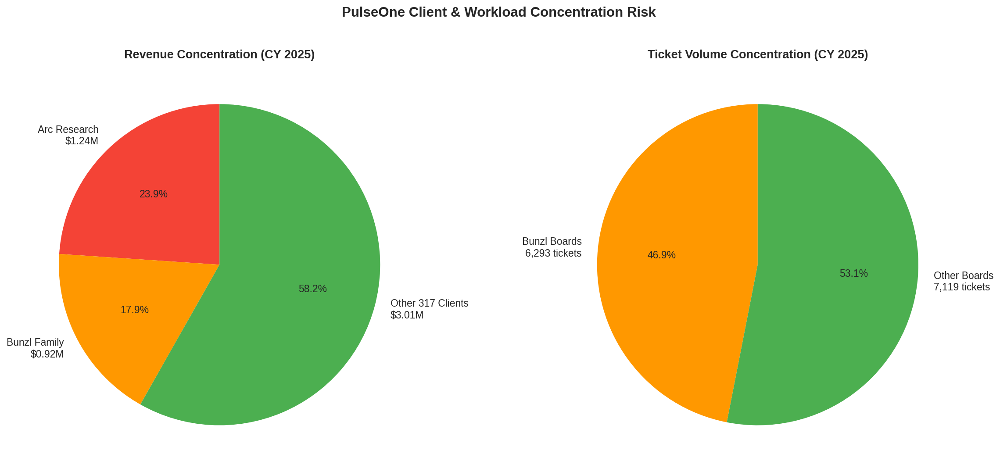
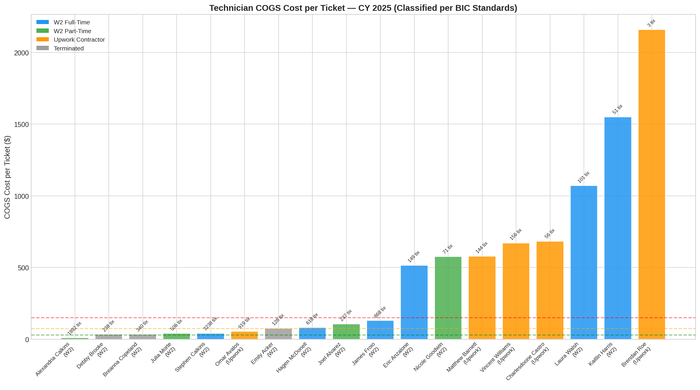
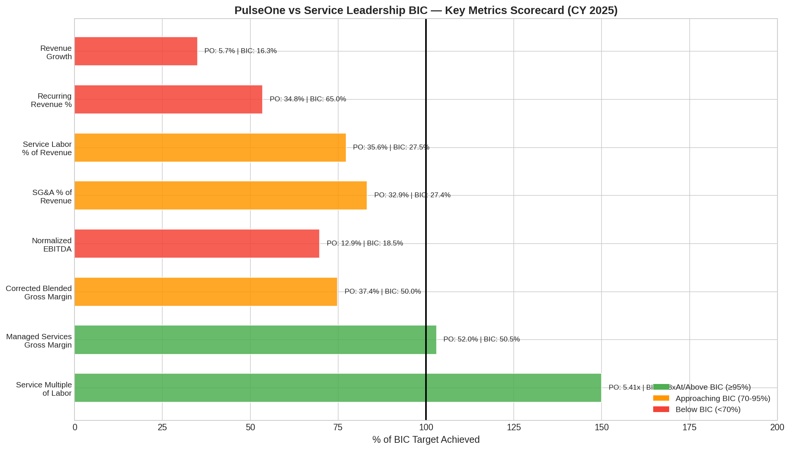

# PulseOne Strategic Audit: Technician Utilization, Cost Efficiency & Client Profitability
*(Revised based on Definitive P&L and COGS Classification Data)*

## A. Objective
This analysis evaluates PulseOne’s technician utilization, service delivery workload distribution, labor cost efficiency, and client-level profitability. The objective is to identify structural inefficiencies, assess the service delivery model against the Service Leadership Best in Class (BIC) framework, and recommend actionable improvements to elevate gross margins and operational maturity.

## B. Evidence Reviewed
The findings in this report are grounded in the following project materials and the `bestinclass` repository data:
- `MonthlyTechnicianTicketCounts2025.xlsx` and `MonthlyTechnicianTicketCounts2026.xls`
- `pulseone-definitive-pl-analysis.md` (CY 2025 Definitive Corrected P&L)
- `pulseone-cogs-classification-analysis.md` (W2 and Upwork role classifications)
- `pulseone-client-profitability-analysis.md` (Revenue by client data)
- `pulseone-utilization-findings.md` (ConnectWise Help Desk utilization data)
- `Service Leadership Best in Class (BIC) Framework Reference.md`

## C. Current Understanding
PulseOne operates a hybrid service delivery model utilizing both W2 employees and offshore/contractor resources via Upwork. Based on the definitive COGS classification, total service delivery labor in 2025 was approximately $1.838 million, representing 35.6% of the $5.17 million in total revenue. 

The initial hypothesis that highly compensated W2 employees (e.g., Walsh, Harris) were highly inefficient front-line technicians was incorrect. The COGS classification analysis confirms these individuals are either management or properly classified service delivery personnel whose costs have now been appropriately allocated. When the labor model is corrected, the core Managed Services delivery team is actually highly efficient, though the overall business suffers from severe client concentration risk and structural SG&A bloat.

## D. Findings

### 1. Exceptional Service Multiple of Labor (Help Desk)
When properly isolated, the Help Desk and ITMS delivery team is operating at an exceptional level of financial efficiency. The total cost of this specific team is approximately $505,608. They support $2.56 million in Managed Services agreement revenue and generated $171,150 in Time & Materials (T&M) billed revenue [1]. 

This yields a **Service Multiple of Labor of 5.41x** ($2.73M revenue / $505K cost) [1]. The Service Leadership BIC target is 2.80x or higher [2]. The Help Desk team is generating nearly double the BIC target for revenue per dollar of labor cost, resulting in a strong 52.0% Managed Services Gross Margin [1].

The previously alarming 23.0% billable recovery rate is a "data trap" typical of mature MSPs; technicians spend the vast majority of their time on flat-fee agreements where hours are logged but not separately billed [1].

### 2. Severe Client and Workload Concentration Risk
The ticket data and revenue data reveal a dangerous operational and economic dependency on two primary relationships.

**The Arc Research Institute**
Arc Research is PulseOne's largest client by a wide margin, generating **$1.237 million in 2025 (23.9% of total revenue)** [3]. This relationship is highly recurring (91.3% agreement revenue) and utilizes a dedicated Upwork resource (Matthew Barnett, $83K fixed price) [3] [4].

**The Bunzl Family**
The Bunzl relationship is structured across multiple legal entities but represents a single economic dependency generating **$923,482 in 2025 (17.9% of total revenue)** [3]. Operationally, Bunzl dominates the service factory. The "Bunzl" and "Dispatch-Bunzl" service boards accounted for **46.9% of all tickets** in 2025 (6,293 out of 13,412 non-system tickets) [5]. 

Combined, PulseOne's top two relationships account for nearly 42% of all revenue. Service Leadership BIC firms typically have no single client exceeding 10–15% of revenue [2]. Operating a service desk where nearly half the workload is dedicated to one client limits the firm's ability to implement a standardized Reference Architecture across a broad client base [2].

### 3. Total Service Delivery Labor Exceeds BIC Targets
While the core Help Desk team is highly efficient, the *total* service delivery labor burden for the company is elevated. 

Total service delivery labor (W2 + Upwork + other contractors) was ~$1.838 million in 2025, or **35.6% of revenue** [4]. BIC MSPs run total service delivery labor at 25–30% of revenue [2]. This 5–10 point gap above the BIC target represents $285,000 to $544,000 in potential gross profit recovery [4]. This suggests that while Help Desk is efficient, other service delivery areas (likely Consulting/Projects) are carrying excess labor costs or suffering from underutilization.

### 4. Upwork Contractor Efficiency and Risks
PulseOne effectively utilizes Upwork contractors to manage costs, spending $299,924 in 2025 [4]. However, this model carries specific risks:
*   **Charlesdoone Castro:** Dedicated to the Amiri Help Desk at $41/hr (930 hours, $38,228 total) [4]. The profitability of this resource is entirely dependent on the Amiri agreement pricing.
*   **Vincent Williams:** The highest-cost Upwork resource ($104,740 at $61/hr) handling IT/Network escalations [4]. At this cost rate, his hours must be billed at $125–$150/hr to maintain BIC margins, or the flat-rate agreements he supports must be priced high enough to absorb his cost.

## E. Service Leadership Best in Class Alignment

PulseOne's current service delivery model shows a mix of exceptional performance and critical structural gaps when evaluated against the Service Leadership BIC framework [2].

| Metric | PulseOne Actual | BIC Target | Status |
| :--- | :--- | :--- | :--- |
| **Service Multiple of Labor** | 5.41x | 2.80x+ | **ALIGNED (Exceeds BIC)** |
| **Managed Services GM %** | 52.0% | 48.7% - 52.4% | **ALIGNED** |
| **Total Service Labor % of Rev** | 35.6% | 25% - 30% | **ABOVE BIC (Negative)** |
| **Corrected Blended GM %** | 37.4% | 50% - 55% | **BELOW BIC (-12.6 pts)** |
| **Normalized EBITDA %** | 12.9% | 18.3% - 19.0%+ | **BELOW BIC (-5.4 pts)** |
| **Client Concentration (Top 1)** | 23.9% | < 10% - 15% | **CRITICAL RISK** |

## F. Risks and Opportunities

**Risks:**
*   **Existential Concentration Risk:** A single contract decision by Arc Research or Bunzl could devastate PulseOne's financial position. The service factory is currently highly customized to support Bunzl's massive ticket volume.
*   **Project/Consulting Margin Drag:** With Managed Services GM at 52.0% but Blended GM at only 37.4%, the Consulting/Projects and Software Resale divisions are severely dragging down overall profitability.
*   **Key-Person Dependency:** S. Calkins handled 3,238 tickets (24% of all non-system tickets) [5]. If this resource departs, the highly efficient Help Desk model will likely fracture.

**Opportunities:**
*   **T&M to Agreement Conversion:** There is a significant opportunity to convert high-volume T&M clients into recurring managed services agreements, improving revenue quality and predictability.
*   **Offshore Optimization:** The Upwork model is clearly working for Arc (M. Barnett) and Amiri (C. Castro). Expanding this dedicated-offshore model to other high-volume clients could further improve margins.

## G. Recommended Actions

1.  **Develop a Client Diversification Strategy:** Set a formal policy that no single client should exceed 15% of revenue. This requires a growth plan that adds $2–3M in new revenue from new clients over 24–36 months to dilute the Arc and Bunzl concentration.
2.  **Audit the Amiri Agreement:** Pull the Amiri agreement from ConnectWise to confirm that Charlesdoone Castro's $38,228 Upwork cost is fully recovered and generating at least a 50% gross margin.
3.  **Audit Vincent Williams' Billing:** Confirm that Williams' 1,706 hours ($61/hr cost) are either billed out at $125+/hr or are fully absorbed by highly profitable flat-rate agreements.
4.  **Investigate Project/Consulting Utilization:** Since the Help Desk is highly efficient, the excess service delivery labor (the gap between PulseOne's 35.6% and the BIC 30% target) is likely hiding in the Consulting division. Run a utilization and project profitability audit for all project engineers and senior subcontractors.
5.  **Address the Bunzl Ticket Anomaly:** Determine why Bunzl generates 46.9% of all tickets but only 17.9% of revenue. This massive disparity suggests the service factory is over-serving Bunzl relative to the revenue yield.

## H. Suggested ConnectWise Follow-up

To advance this audit, the following data must be retrieved from the ConnectWise AI interface:

1.  **Agreement Profitability for 'Bunzl' and 'Amiri':** We need the effective hourly rate realized on these specific clients to determine if the high ticket volume (Bunzl) and dedicated Upwork cost (Amiri) are profitable.
2.  **Project Profitability:** Project-level profitability for all projects closed in 2025 to isolate the margin drag in the Consulting division.
3.  **Vincent Williams Time Entries:** A report of all time entries by V. Williams in 2025, showing which clients and agreements his high-cost hours were applied against.

## References

[1] pulseone-utilization-findings.md, PulseOne bestinclass Repository.
[2] Service Leadership Best in Class (BIC) Framework Reference, Project Knowledge Base.
[3] pulseone-client-profitability-analysis.md, PulseOne bestinclass Repository.
[4] pulseone-definitive-pl-analysis.md, PulseOne bestinclass Repository.
[5] updated_cost_analysis.py Output Data, PulseOne Ticket Analysis.
